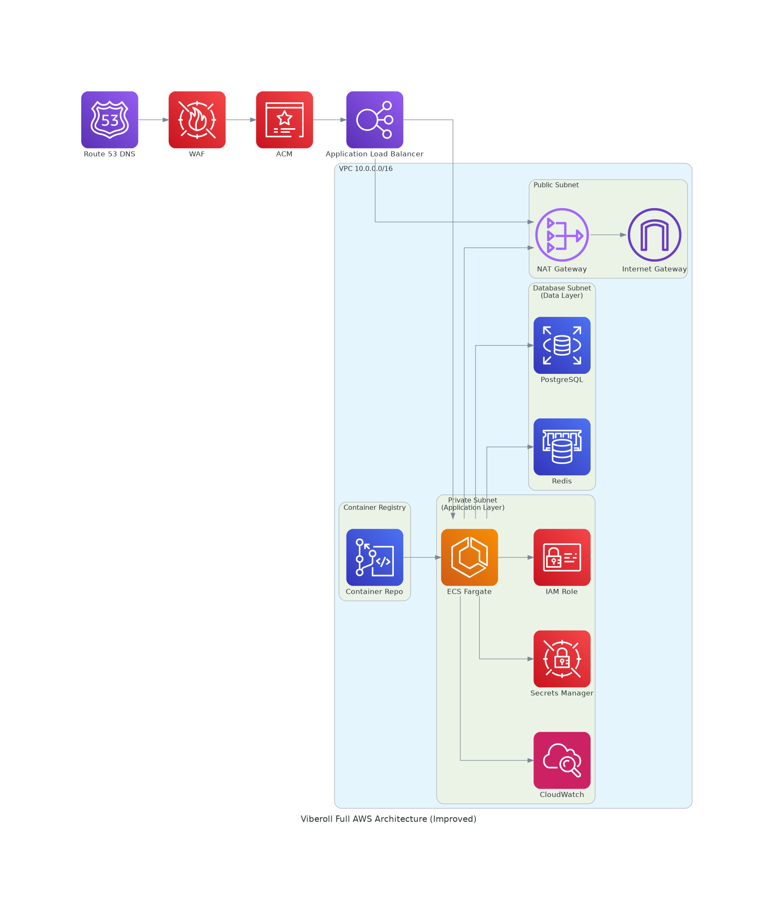

# VibeRoll Infra

Infrastructure as Code (IaC) for the **VibeRoll** application — a modern, AI-powered video sharing platform. This repo provisions all AWS infrastructure components using **Terraform** and handles **CI/CD** via **GitHub Actions**.



---

## What’s Inside?

### Infrastructure Managed
- **VPC** with public/private subnets
- **ALB** (Application Load Balancer)
- **ECS Fargate** for containerized app hosting
- **RDS (PostgreSQL)** for relational storage
- **ElastiCache (Redis)** for caching
- **Secrets Manager** for environment secrets
- **ECR** for Docker image storage
- **WAF** for web firewall protection
- **CloudWatch** for logging & metrics

### ⚙️ CI/CD Pipelines
- **viberoll-backend** repo builds Docker images on push to `main` and pushes to ECR.
- On successful image push, it dispatches a `deploy-trigger` to this repo.
- This repo listens and automatically deploys infra with latest image.

---

## 📂 Project Structure

```
celestn@CN001:/mnt/c/visual_studio_code/express-project/viberoll-project/viberoll-infra$ tree -I 'node_modules' -L 3
viberoll-infra/
├── README.md
├── backend.tf
├── destroy.sh
├── main.tf
├── modules
│   ├── alb
│   │   ├── main.tf
│   │   ├── outputs.tf
│   │   └── variables.tf
│   ├── cloudwatch
│   │   ├── main.tf
│   │   ├── outputs.tf
│   │   └── variables.tf
│   ├── ecr
│   │   ├── main.tf
│   │   ├── outputs.tf
│   │   └── variables.tf
│   ├── ecs
│   │   ├── main.tf
│   │   ├── outputs.tf
│   │   └── variables.tf
│   ├── elasticache
│   │   ├── main.tf
│   │   ├── outputs.tf
│   │   └── variables.tf
│   ├── rds
│   │   ├── main.tf
│   │   ├── outputs.tf
│   │   └── variables.tf
│   ├── secrets
│   │   ├── main.tf
│   │   ├── outputs.tf
│   │   └── variables.tf
│   ├── vpc
│   │   ├── main.tf
│   │   ├── outputs.tf
│   │   └── variables.tf
│   └── waf
│       ├── main.tf
│       ├── outputs.tf
│       └── variables.tf
├── outputs.tf
├── terraform.tfvars
└── variables.tf

11 directories, 34 files

```

---


## Environment Variables (Secrets)

All required secrets are stored in **GitHub Actions** > `Settings > Secrets and Variables`.

Here are some examples:

| Name                              | Description                                                            |
| --------------------------------- | ---------------------------------------------------------------------- |
| `TF_PROJECT_NAME`                 | Project name prefix                                                    |
| `TF_DB_USERNAME`                  | Database user for RDS                                                  |
| `TF_DB_PASSWORD`                  | Database password                                                      |
| `TF_DB_NAME`                      | Name of the RDS database                                               |
| `TF_ECR_REPO_NAME`                | Name of the Docker ECR repository                                      |
| `TF_CONTAINER_IMAGE`              | Full ECR image URI for container deployments                           |
| `TF_JWT_SECRET`                   | JWT auth token signing key                                             |
| `TF_JWT_REFRESH_SECRET`           | Refresh token secret                                                   |
| `TF_JWT_ACCESS_TOKEN_EXPIRATION`  | Access token expiration (e.g., `15m`)                                  |
| `TF_JWT_REFRESH_TOKEN_EXPIRATION` | Refresh token expiration (e.g., `7d`)                                  |
| `TF_NODE_ENV`                     | Environment name (e.g., `production`, `development`)                   |
| `TF_HOST`                         | Application host URL                                                   |
| `TF_PORT`                         | Application port                                                       |
| `TF_VPC_CIDR`                     | VPC CIDR block                                                         |
| `TF_AZ1`, `TF_AZ2`                | Availability Zones for high availability                               |
| `TF_SALT_ROUNDS`                  | Bcrypt salt rounds for password hashing                                |
| `TF_RPC_URL`                      | Blockchain RPC URL                                                     |
| `TF_WALLET_PRIVATE_KEY`           | Private key for wallet signing                                         |
| `TF_NFT_CONTRACT_ADDRESS`         | Smart contract address for NFTs                                        |
| `TF_OPENAI_API_ENDPOINT`          | Endpoint for OpenAI API usage                                          |
| `TF_OPENAI_API_KEY`               | Key for accessing OpenAI services                                      |
| `TF_ADMIN_EMAIL`                  | Admin user email                                                       |
| `TF_ADMIN_PASSWORD`               | Admin user password                                                    |
| `TF_ADMIN_USERNAME`               | Admin username                                                         |
| `AWS_ACCESS_KEY_ID`               | AWS access key ID for GitHub Actions                                   |
| `AWS_SECRET_ACCESS_KEY`           | AWS secret access key for GitHub Actions                               |
| `PAT_TOKEN`                       | GitHub Personal Access Token (for accessing private repos or packages) |

---

## Deployment Workflow

Triggered on:
- Push to `main` branch in `viberoll-infra`
- OR `repository_dispatch` from `viberoll-backend`

### Steps:
1. Validates required secrets
2. Writes a `secrets.auto.tfvars.json`
3. Executes `terraform plan` and `apply`
4. Provisions ECR, ECS, ALB, RDS, ElastiCache, etc.
5. Uploads secrets to AWS Secrets Manager

See: `.github/workflows/deploy.yml`

---

## Destroy Workflow

Manually triggered via GitHub Actions → **Run workflow**

### What it does:
- Generates same secrets file
- Runs `terraform plan -destroy` + `apply`
- Cleans up:
  - AWS resources
  - AWS Secrets in Secrets Manager
  - ECR repo (with `--force`)

See: `.github/workflows/destroy.yml`

---

## Best Practices Followed

✅ Modular Terraform  
✅ GitHub Actions secrets validation  
✅ Remote backend (S3)  
✅ State locking with DynamoDB  
✅ Secrets never committed  
✅ Clean destroy pipeline  
✅ `prevent_destroy = false` where needed  

---

## Future Enhancements

✅ Docker image digests instead of `:latest`
✅ Trigger deploy only on successful image build
✅ Rollback support with tagged images
✅ Previews per pull request using dynamic environments
⏳ Sync secrets to SSM Parameter Store for EC2-based compatibility
⏳ Slack notifications on deploy

---

## Testing Your Setup

**To test the deployed app:**

```bash
curl -X POST \
  https://<alb-dns>/api-docs/auth/register \
  -H "Content-Type: application/json" \
  -d '{"email":"test@demo.com","username":"demo","password":"123456"}'

```

---

## Contributing

We love PRs! Feel free to fork, improve, and open a pull request.

## License
MIT License. See LICENSE file.